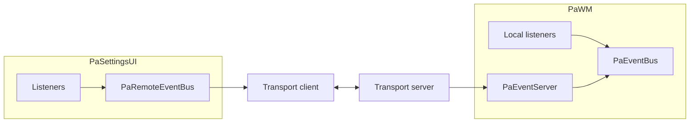

# PaEventKit

Typed pub/sub and request/reply between PineappleWM processes. Apps implement `Listener` and call `publish` / `ask`. XPC is one transport, not the API.

**Host** is PaWM: it owns `PaEventBus` and accepts remote connections. **Clients** (Settings, CLIs, or other app that wants to interact with the host) use `PaRemoteEventBus` over a transport you inject.

> This framework has been made with the assumption that this can change in the future or be used in a different context. PaWM is indeed the host implementation, but it isn't the only possibility this framework allows.

## Guides

- [Host](Docs/Host.md) — bus, listeners, accepting remotes
- [Client](Docs/Client.md) — connecting, publishing, asking, listening
- [API](Docs/API.md) — public types

## Host vs client



| Process | Access point | Typical setup |
|---------|----------------|---------------|
| Host | `PaEventBus` | `PaEventServer` + `XPCRemoteEventTransportAcceptor(eventServer:machServiceName:)` |
| Clients | `PaRemoteEventBus` | `XPCRemoteEventTransportClient(machServiceName:)` |

## `publish` vs `ask`

| | `publish` | `ask` |
|---|-----------|-------|
| Meaning | Fire-and-forget fan-out | Wait for one reply |
| Who handles it | Every matching listener, including remotes. The host echoes a remote publish back to the sender. | **Local host listeners only.** First `reply(...)` wins. |
| Remote listeners | Receive it | Do not. A remote `ask` is answered on the host. |

```swift
bus.publish(.switchSpace(PaSwitchSpaceEvent(spaceIndex: 2)))

let pong = try await bus.ask(.debugPing(PaDebugPingEvent()))
```

## Events

Closed catalog on `PaEvent` / `PaEventKind`. Payloads live in this kit so every process decodes the same type. Add cases here, not in any other target.

See [API](Docs/API.md#events).
